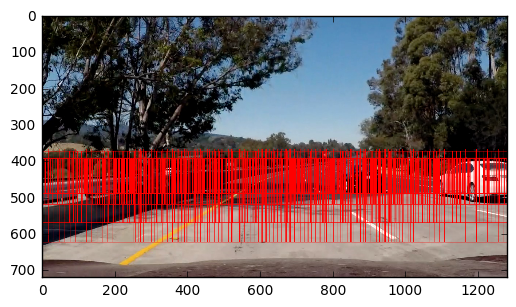

# CarND-Vehicle-Detection

The goal of the project is to write a software pipeline to detect vehicles in a video using sliding window classification approach.
Udacity provides two sets of 64x64 images for binary classification:
* [8792 images of vehicles](https://s3.amazonaws.com/udacity-sdc/Vehicle_Tracking/vehicles.zip)
* [9666 images of non-vehicles](https://s3.amazonaws.com/udacity-sdc/Vehicle_Tracking/non-vehicles.zip)

Final vehicle detection pipeline should correctly track vehicles on the road and eliminate false positive detections, which can be dangerous for a real Self-Driving Car for several reasons.

Here I describe most valuable pats of the code according to Udacity's project rubric:
* Histogram of Oriented Gradients (HOG) usage
* Sliding Window Search implementation
* Video application

## Histogram of Oriented Gradients (HOG) usage

The heart of the pipeline is Histogram of Oriented Gradients or HOG, which is implemented in scikit image package as [`skimage.feature.hog`](http://scikit-image.org/docs/dev/api/skimage.feature.html#skimage.feature.hog).

Here is a wrapper code snippet used in pipeline:
```
def get_hog_features(img, orient, pix_per_cell, cell_per_block, vis=False, feature_vec=True):
    # Call with two outputs if vis==True
    if vis == True:
        features, hog_image = hog(img, orientations=orient, pixels_per_cell=(pix_per_cell, pix_per_cell),
                                  cells_per_block=(cell_per_block, cell_per_block), transform_sqrt=True, 
                                  visualise=vis, feature_vector=feature_vec)
        return features, hog_image
    # Otherwise call with one output
    else:      
        features = hog(img, orientations=orient, pixels_per_cell=(pix_per_cell, pix_per_cell),
                       cells_per_block=(cell_per_block, cell_per_block), transform_sqrt=True, 
                       visualise=vis, feature_vector=feature_vec)
        return features
```

Essential parameters here are `orient`, `pix_per_cell` and `cell_per_block` which have to be defined to work well for this task.

Another tricky thing is `img` -- this must be 1-channel input and this can be either grayscaled image or a particular color channel from a color space.

To handle this parameter search I created another snippet of code which gets whole input dataset of raw images, converts it into particular color space and uses one of desired channels.

```
def get_hog_data(X, colorspace, orient, pixpercell, cellperblock, featuresize):
    Xhog = np.zeros((X.shape[0], featuresize), dtype=np.float32)
    
    for idx in range(X.shape[0]):
        if colorspace == 'gray':
            x = cv2.cvtColor(X[idx], cv2.COLOR_RGB2GRAY)
        else:
            hls = cv2.cvtColor(X[idx], cv2.COLOR_RGB2HLS)
            x = hls[:,:,['h', 'l', 's'].index(colorspace)]
        
        f = get_hog_features(x, orient, pixpercell, cellperblock)
        Xhog[idx] = f
        
    return Xhog
```

To actually pick HOG params, I used grid search for tihs parameters together with different classifier.
This allowed me to answer two questions at once:
* what classifier works best for this task
* what HOG params to use

With next evaluation snippet of code I performed several examinations.
```
def examine_hog_params_and_classifiers(colorspace, orient, pixpercell, cellperblock):
    # get vector size, doesnt matter which color space to use
    sample_feature = get_hog_features(cv2.cvtColor(sample_image, cv2.COLOR_RGB2GRAY), orient, pixpercell, cellperblock)
    vector_size = sample_feature.shape[0]
    
    # transform raw pixel data into hog features
    X_train = get_hog_data(X_TRAIN, colorspace, orient, pixpercell, cellperblock, vector_size)
    X_test =  get_hog_data(X_TEST,  colorspace, orient, pixpercell, cellperblock, vector_size)

    # get scaler from training data
    X_scaler = StandardScaler().fit(X_train)

    # transform all X data with scaler
    X_train = X_scaler.transform(X_train)
    X_test = X_scaler.transform(X_test)
    
    print('colorspace {}, orient {}, pixpercell {}, cellperblock {}'.format(colorspace, orient, pixpercell, cellperblock))
    for c in classifiers:
        clf = c()
        clf.fit(X_train, Y_TRAIN)
        print(c, clf.score(X_test, Y_TEST))
```

Search space included next values to examine:
* `classifiers`: LinearSVC, DecisionTreeClassifier, BaggingClassifier, ExtraTreesClassifier, GradientBoostingClassifier, RandomForestClassifier
* `colorspace`: ['gray', 'h', 'l', 's']  -- e.g. grayscale and channels of HLS color space
* `orient`: [6, 8, 10, 12]
* `pixpercell`: [4, 6, 8, 10, 12, 14, 16, 18, 20]
* `cellperblock`: [1, 2, 3, 4]

After grid search experiments I finished with next results:
* L-channel gives best results for HOG features, noteworthy is grayscale is also good
* GradientBoostingClassifier works best among other classifiers
* orient value of 10 gives best results
* more pixpercell produced more accuracy; best results I got with 16
* cells per block value of 2 gives best results

Resulting accuraci for GradientBoostingClassifier:
* train set -- 0.985168630638
* test set -- 0.968309859155

Of course, there is a lot of space for tuning classifier parameters, but this accuracy is good enough.

Below is an example of images with chosen HOG parameters (`HOG_ORIENT = 10`, `HOG_PPC = 16`, `HOG_CPB = 2`)


Well actually this looks not very descriptive for a human eye, but works very well :)

Key points:
* HOG parameters such color space, orientation, and others were choosen by grid search to get highest classification results
* GradientBoostingClassifier was choosen in same way
* [`sklearn.preprocessing.StandardScaler`](http://scikit-learn.org/stable/modules/generated/sklearn.preprocessing.StandardScaler.html) used to normalize data

## Sliding window implementation

For sliding window approach I defined that objects in right and left part of the image need more rectangle-based windows to correctly identify the car.
For this, I used square basic sizes for windows, but also non-linear approach to handle this perspective transformations.
The common idea looks so:
* take initial window size, e.g. 96 pixels
* define center position of the window based on initial window size and overlap factor
* use height same as window size, e.g. 96 pixels
* calculate width with next formula:
  + $Size_{new} = Size_{default} * (1 + (\frac{center_{window} - center_{image}}{0.5 * Size_{image}})^2)$
  + i.e. if window is far left/right from center, use more rectangled window, because of perspective
  
I also defined that it is redundant to take windows from very bottom of the image, better to use some offsets.
With some manual checks on test frames I finished with 4 rows of windows with overlapping factor of `0.05`:

| Bottom offset | Initial width/height |
| --- | --- |
| 96 | 256 |
| 150 | 196 |
| 200 | 128 |
| 230 | 96|

Code snippet for sliding windows:
```
def get_sliding_windows(img):
    windows = []
    images = []
    
    # For every defined sliding window
    for bottom_offset, window_size in SLW_WINDOWS:
        # Define step and total number of windows
        step = int(window_size * SLW_OVERLAP)
        total_windows = IMG_WIDTH // step + 1
        
        # For every single window
        for i in range(total_windows):
            # Define center and window width
            center = i * step
            deviation = float(center - IMG_CENTER) / IMG_CENTER
            window_width = int((window_size / 2) * (1. + deviation ** 2))
            
            # Calculate left and right X positions
            if center - window_width < 0:
                xleft = 0
                xrigh = center + window_width
            elif center + window_width > IMG_WIDTH:
                xleft = center - window_width
                xrigh = IMG_WIDTH
            else:
                xleft = center - window_width
                xrigh = center + window_width
                
            # Calculate Y positions
            yleft = IMG_HEIGTH - bottom_offset
            yrigh = yleft - window_size
            
            # Remember box coordinates and image patch
            windows.append([(xleft, yleft), (xrigh, yrigh)])
            images.append(img[yrigh:yleft, xleft:xrigh, :])
            
    return windows, images
```

Here is how sliding windows over a test image look like:


Okay, we have many image patches (images) and their positions (windows).
Because these images have different sizes according to window sizes, they are resized to 64x64 as initial classifier.
```
def prepare_image_patch_for_classifier(img):
    if img.shape[0] != 64 or img.shape[1] != 64:
        img = cv2.resize(img, (64, 64))
    img = np.expand_dims(img, axis=0)
        
    return img
```

Next step is to create a heatmap of positive detections:
```
def get_vehicles_heatmap_from_image(source_image, probability=.85):
    # Get all sliding windows and image patches
    windows, images = get_sliding_windows(source_image)
    
    # Define heatmap as zeros image
    heatmap = np.zeros((source_image.shape[0], source_image.shape[1]), dtype=np.uint8)
    
    i = 0
    for i in range(len(windows)):
        wnd, img = windows[i], images[i]
        
        # Preprocess image patch
        img = prepare_image_patch_for_classifier(img)
        img = preprocess_input(img)
        
        # Classify, but take not 0 or 1 class prediction, but raw probability
        clfproba = clf.predict_proba(img)[0]
        
        # Only if probability is high enouth, consider patch as vehicle and update heatmap
        if clfproba[1] > probability:
            xleft, yleft = wnd[0]
            xrigh, yrigh = wnd[1]
            heatmap[yrigh:yleft, xleft:xrigh] += 1

    return heatmap
```

Initially heatmap is just zero-filled integer matrix with image shape.
For every positive detection corresponding pixels values on the heatmap increase by 1.
One of the most challenging parts in this project is how to get boundary boxes from this heatmap.
To solve this, I first make a binary mask for the heatmap -- pixels with intensity more than 1 will be counted for boundary building.
This manual simple treshold of 1 was tested together with otsu treshold [`skimage.filters.threshold_otsu`](http://scikit-image.org/docs/dev/api/skimage.filters.html?highlight=skimage%20filters#skimage.filters.threshold_otsu) and actually performed better than otsu.
Then merge overlapped windows into one by using [`skimage.measure.label`](http://scikit-image.org/docs/dev/api/skimage.measure.html#skimage.measure.label) and [`skimage.measure.regionprops`](http://scikit-image.org/docs/dev/api/skimage.measure.html#skimage.measure.regionprops) functions.
Detected regions with area less than 5000 pixels are discarded, this allows to reduce many false positives already.

```
def get_boundaries_from_heatmap(heatmap):
    # If heatmap is empty, return empty boundaries
    if(heatmap.max() == 0):
        return []
    
    # Consider only heatmap valies greater than 1
    thresh = 1
    mask = np.zeros_like(heatmap)
    mask[heatmap > thresh] = 1
    
    # Use skimage.measure.label to label regions on the mask
    labeled = label(mask)
    boxes = []
    
    # Use skimage.measure.regionprops to get regois our of labelled image. Keep only images with big area
    for region in regionprops(labeled):
        if region.area < 5000:
            continue
        
        minr, minc, maxr, maxc = region.bbox
        boxes.append(((minc, minr), (maxc, maxr)))
    return boxes
```

## Video processing

To get rid of false positives on the video I keep tracking centroid of detected boxes. On every frame the logic is next:
* get boxes with sliding window;
* for every found box calculate centroid;
* use centroid trackers to define if current centroid belongs to already tracked vehicle;
* if no tracker matched this centroid, create new tracker;
* draw box only if tracker has several successful centroids -- this is the most important part of getting rid of false; positives. Tracked vehicles will pass this condition successfully and draw boxes, but false positive trackers will fail and die soon.

As noted, if tracker has no new detections for several steps (DEATH_TOLERANCE), it will be considered as dead and removed.
Thus, only correct vehicle tracking trackers will survive and draw boxes from frame to frame.

Code for this is structured into 3 classes: `Centroid`, `CentroidTracker` and `ImageProcessor`.
Below is code snippet ot `ImageProcessor.process_frame` function which gives overall understanding of how described steps are implemented in code.

```
# Main frame processing function
def process_frame(self):
    # First, get boxes from current image
    heatmap = get_vehicles_heatmap_from_image(self.current_frame)
    boxes = get_boundaries_from_heatmap(heatmap)

    # reset tracker states before frame processing
    self.pre_frame_action()

    # check every found box
    for box in boxes:
        # get centroid
        c = Centroid()
        c.init_from_box(box)

        # by default, centroid is considered as a trash
        frame_box = None
        is_assigned = False
        is_drawable = False

        # try current centroid for every tracker to see which one it can match
        for tracker in self.trackers:
            # if matches, append to that tracker and check if it is drawable
            if tracker.check_new_centroid(c):
                tracker.append_centroid(c)

                frame_box = box
                if (tracker.last_box):
                    frame_box = self.get_averaged_box(tracker.last_box, frame_box)
                tracker.set_last_box(frame_box)

                is_assigned = True
                is_drawable = tracker.is_last_centroid_drawable()
                break

        # not matched to any tracker -- maybe a new car appeared on the road?
        if not is_assigned:
            newtracker = CentroidTracker(c)
            self.trackers.append(newtracker)

        if is_drawable:
            self.draw_box_on_frame(frame_box)

    # If no boxes found, check if any tracker is good enough to be restored
    if not len(boxes):
        for t in self.trackers:
            if t.is_restorable():
                self.draw_box_on_frame(t.last_box)

    self.post_frame_action()
    return self.current_frame
```

Some noteworthy points here -- even if centroid is considered to match a tracker, its box may still be discarded from being drawn.
The condition to being drawable is to have previously defined centroids.
This is the most important part of eliminating false positives.
Because of some frames have no detections, I allow restoring prevous boxes if tracker is stable enough, i.e. has lot of good detections in last frames.
Another interesting point is for drawable box I use weighted sum of previous box and current one, this makes boxes in video much smoother.

Here is a resulting project video generated by described pipeline.

[](https://www.youtube.com/watch?v=_nWmVioHDW4)
